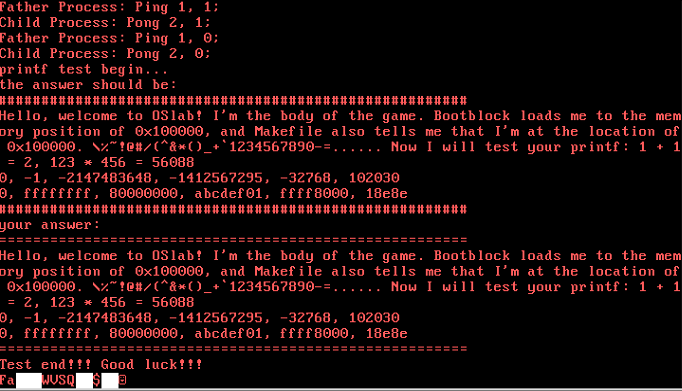

#<center>lab3实验报告</center>
<center>欧阳欣</center>
<center>181860068</center>
<center>m15979634309@163.com</center>

## 实验进度
* 完成了全部的必做实验内容

## 实验结果
* 完成了```syscall.c```中的四个库函数
* 完成了时钟中断的处理，可以进行正常的时钟中断处理，包括进程的上下文切换
* 完成了系统调用例程```syscallFork syscallSleep syscallExit syscallExec```


## 实验过程描述
##### 1. 完成库函数
* 需要完成的库函数的功能是将输入的参数转化成系统调用需要的参数，然后返回合适的系统调用的返回值
1. fork:该库函数进行的系统调用不需要额外参数，直接将系统调用号```SYS_FORK```传入```syscall```。
2. exec:该库函数输入参数有文件名和额外参数，此处不处理额外参数，只是将文件名字符串的长度进行计算传入系统调用函数，方便处理。
3. sleep：同fork。
4. exit：同fork。

#### 2.处理时钟中断
* 时钟中断处理程序需要对进程控制块的相关数据进行更新，并在当前进程达到切换条件的时候进行进程的切换
1. 更新休眠（被阻塞）进程控制块信息：对进程序列中的所有处于```STATE_BLOCKED```状态的进程的控制块的```sleeptime```减一，当阻塞的进程的```sleeptime``` 等于零时，就将进程控制块设为```STATE_RUNNABLE```状态，即将其唤醒。
2. 对进程进行调度：此处采取轮换的调度策略，即将进程控制块序列中的所有处于```STATE_RUNNABLE```状态的进程依次顺序地进行调度。当前进程的时间片在每次触发时钟中断时，都会增加进程控制块中的时间片占用```timecount + 1```，当时间片占用到达最大```MAX_TIME_COUNT```，就在进程控制块序列中寻找排在当前进程控制块后面的```STATE_RUNNABLE```进程控制块，并启动上下文切换。
3. 上下文切换：上下文切换重要的地方在于将进程控制块保留的进程的栈信息还原。当前处于内核态，首先将进程控制块记录的进程内核栈顶位置还原，然后通过```popal```指令将这段内核栈上记录的各个寄存器的信息还原，从而使得用户态的```esp,eip```等关键的寄存器信息还原，从而能够切换到指定的新的“当前进程”。

#### 3.syscallFork
* Fork函数的功能是复制当前进程信息，并创建一个新的进程，给新进程返回0，父进程返回新进程的进程号
1. 遍历进程控制块序列，找到一个空闲的进程控制块，即```STATE_DEAD```控制块，用于创建新的进程控制块
2. 初始化新进程控制块信息：除了一般的初始化信息之外，还要复制父进程控制块记录的用户态寄存器信息。对新进程的用户态段寄存器的信息的赋值需要进行一些稍微复杂的计算，即新进程的用户堆栈和代码段寄存器的段表索引按约定被设置为```pid*2+1```。
3. 分配新进程用户内存：复制进程控制块记录的内核栈信息；复制父进程的用户栈数据到新进程的用户栈内存区域上，不同进程的用户栈区域按约定被分配到```(pid+1)*0x100000```

#### 4. syscallExec
* Exec函数的功能是在当前进程的用户栈区域中加载文件名指向的程序到合适位置，开始新的程序的执行并不再返回。这个加载过程会覆盖原程序的代码
1. 取出用户态传入的文件名参数，和```syscallPrint```系统调用中使用的方法类似，用指定的段寄存器加地址的方式取出一个个字符。
2. 使用LoadElf函数加载程序，并根据返回的入口地址执行代码。
3. LoadElf：与LoadMain函数基本相同，只不过将指定的文件名改成了使用参数传入文件名，并将加载起始位置返回。

#### 5. syscallSleep
* Sleep函数的功能是将当前进程置入休眠状态，即将当前进程的进程控制块中的进程状态设置为```STATE_BLOCKED```并且将```sleeptime```设置为参数传入的值，当然对于传入的参数需要进行合法性检测。做完这些之后，以陷阱的方式模仿时钟中断，进行上下文切换。

#### 6. syscallExit
* Exit函数的功能是中止当前的进程，只需要将当前进程控制块的进程状态设置为```STATE_DEAD```，然后用陷阱的方式模仿时钟中断，进行上下文切换。